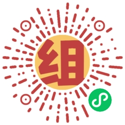

## :wave: Hi there

:tada: Welcome to my profile. I’m Jiajie Han (aka dxs, dxsooo, ZeoHan)

- :monocle_face: Currently focus on data life cycle (aggregation, annotation, integration, management, etc) of **AI** and **AutomaticDrive**
- :man_technologist: Currently coding with **Golang/Python/Vue**
- :man_student: Graduated from BUPT in 2017 with master of EE degree

### :rocket: Projects

<!-- #### :: data life cycle -->

**Data aggregation**

**Useful tools**

<!-- **Other applications**

 -->

:mailbox: Reach me with issues and pull requests in your interest project.

### :mega: Ads

- 组了个名：用成员名字起一个谐音成语作为组名

### :hammer_and_wrench: Skills

<!-- **Languages, frameworks and libraries** -->

<!-- **Tools, databases and storage** -->

### :chart_with_upwards_trend: Statistics

